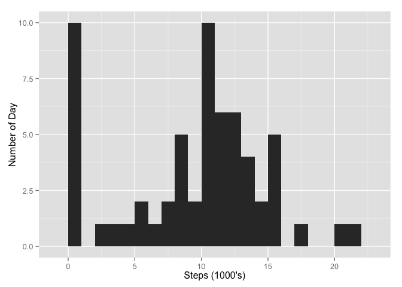
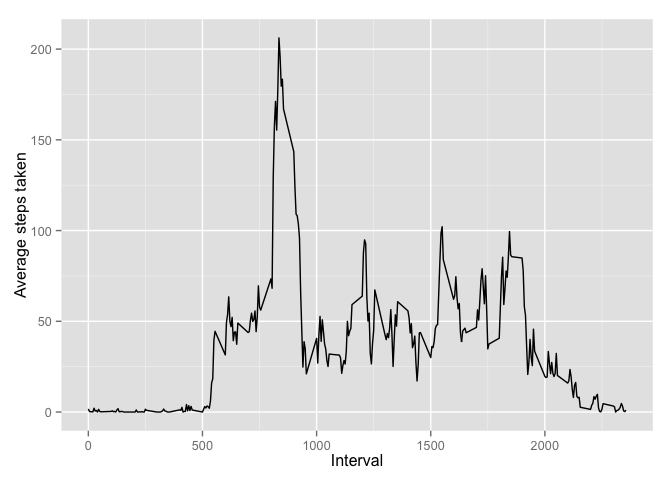
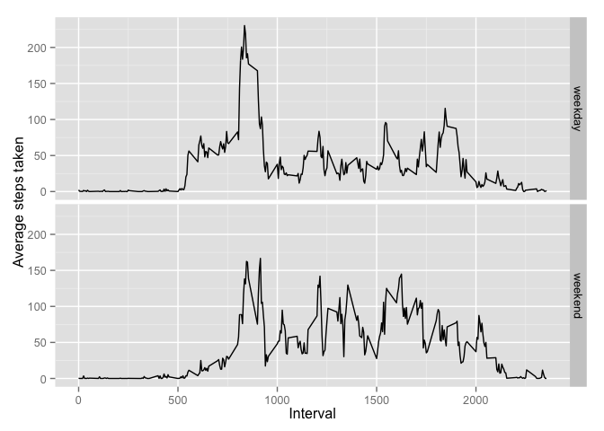

# Reproducible Research: Peer Assessment 1


## Loading and preprocessing the data

* Load the required libraries and set the global options

```r
library(knitr)
library(dplyr)
library(ggplot2)
opts_chunk$set(echo=TRUE) 
```


* Read the activity dataset

```r
activity <- read.csv("activity.csv") %>% mutate(date=as.Date(date,"%Y-%m-%d"))
```

## What is mean total number of steps taken per day?


```r
summ_act <- activity %>% group_by(date) %>% summarise(tot_steps=sum(steps,na.rm=TRUE))

ggplot(summ_act, aes(tot_steps/1000)) +
  geom_histogram(binwidth = 1) +
  labs(x = "Steps (1000's)", y = "Number of Day")
```

 


```r
summarise(summ_act,mean_steps=mean(tot_steps,na.rm=TRUE),median_steps=median(tot_steps,na.rm=TRUE))
```

```
## Source: local data frame [1 x 2]
## 
##   mean_steps median_steps
## 1    9354.23        10395
```

## What is the average daily activity pattern?


```r
avg_steps <- activity %>% group_by(interval) %>% summarise(avg_steps=mean(steps,na.rm=TRUE))
ggplot(avg_steps,aes(x=interval,y=avg_steps)) +
  geom_line() +
  labs(x = "Interval", y = "Average steps taken")
```

 

```r
max_interval <- avg_steps$interval[which.max(avg_steps$avg_steps)]
max_value <- max(avg_steps$avg_steps)
```

Interval [835] has the max average value of [206.1698113].

## Imputing missing values


```r
tot_missing <- sum(is.na(activity$steps))
```

Total number of missing values = 2304

Filling the NA's by average value for the interval


```r
act_filled <- activity %>% left_join(avg_steps, by="interval") %>% mutate(steps=ifelse(is.na(steps),avg_steps,steps))
```

Replotting the histogram now

```r
summ_act <- act_filled %>% group_by(date) %>% summarise(tot_steps=sum(steps,na.rm=TRUE))

ggplot(summ_act, aes(tot_steps/1000)) +
  geom_histogram(binwidth = 1) +
  labs(x = "Steps (1000's)", y = "Number of Day")
```

 


```r
summarise(summ_act,mean_steps=mean(tot_steps,na.rm=TRUE),median_steps=median(tot_steps,na.rm=TRUE))
```

```
## Source: local data frame [1 x 2]
## 
##   mean_steps median_steps
## 1   10766.19     10766.19
```

The histograms are similar and we observe the average have moved up and median is nearly same.

## Are there differences in activity patterns between weekdays and weekends?


```r
wd <- act_filled %>% mutate(day_typ=ifelse(weekdays(date) %in% c("Sunday","Saturday"),"weekend","weekday"))  %>% group_by(interval,day_typ) %>% summarise(steps=mean(steps))

ggplot(wd,aes(x=interval,y=steps)) +
  geom_line() + facet_grid(day_typ~.) +
  labs(x = "Interval", y = "Average steps taken")
```

 

